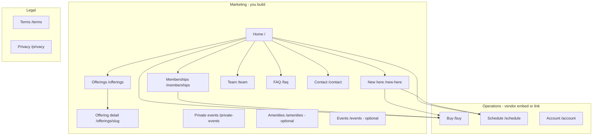

# United Strength — information architecture

**Design direction:** Client-approved editorial private club — not a traditional gym site. See [client-direction-brief-2026-06-24.md](client/client-direction-brief-2026-06-24.md) and [inspiration-index.md](reference/inspiration-index.md). IA remains Sukha-first (application flow, `/new-here` journey, hidden public pricing).  
**Status:** Client direction approved 2026-06-24 — trim or extend per [client-discovery.md](client-discovery.md). **Beta:** Public nav hrefs must match the AI Studio preview overlay — see [ai-studio-brief.md](client/ai-studio-brief.md).

---

## Home narrative arc (client-approved 2026-06-24)

Maps the five communication goals from [client-direction-brief-2026-06-24.md](client/client-direction-brief-2026-06-24.md) to home and site sections.

| Communication goal | Home / site section | Notes |
|--------------------|---------------------|-------|
| Who we are | Hero + brand story | Cinematic full-bleed; STRONGER UNITED; club positioning |
| What we stand for | Pillars (Train · Recover · Community) | Standards and values — not class catalog |
| Why we're different | Editorial contrast block | Club-not-gym; luxury hospitality vs traditional gym |
| United ecosystem | Offerings hub + optional amenities/recovery | Educate on full experience — coach-led, open gym, recovery (if confirmed) |
| How to apply | `/memberships` application CTA + `/new-here` journey | Application-first; no public tier pricing on marketing site |

**Primary site purpose (client-approved):** Showcase culture · establish standards · create desire · educate on ecosystem · drive applications.

---

## Current site → new site mapping

Source: [current-site-content-inventory.md](current-site-content-inventory.md)

| Current URL (Squarespace) | New URL (proposed) | Notes |
|---------------------------|-------------------|-------|
| `/` | `/` | Hero, testimonials, tour form, #ColumbUS |
| `/classes` | `/offerings` | Hub |
| `/classes/build` | `/offerings/build` | Schedule + description |
| `/classes/burn` | `/offerings/burn` | Schedule + description |
| `/personal-training` | `/offerings/private-training` | Not in current main nav |
| `/pricing` | `/memberships` | Public pricing today |
| `/sign-up-1` | — | Retire; merge pricing (resolve $90/$95 conflict) |
| `/become-a-member` | `/memberships` | Application form section |
| `/our-team` | `/team` | Grid |
| `/johnson`, `/farkas`, `/katz`, `/shaffer` | `/team` or `/team/[slug]` | Full bios |
| `/contact` | `/contact` | Map, hours, tour form |
| `/our-partners` | `/contact` or `/about` | Community partners block |
| `/blog` | Optional `/blog` | 11 posts — v1 default off |
| Xplor Triib portal | `/buy`, `/schedule`, `/account` | Embeds |
| — | `/new-here` | New visitor journey (no current equivalent) |
| — | `/faq` | No FAQ on current site |
| — | `/terms`, `/privacy` | Not on current site |

---

## Site map

---

## Primary navigation (marketing — Todd Jul 2026)

Public site only. Member operations (Triib) are **not** in this nav.

| Label | URL | Notes |
|-------|-----|-------|
| *(Hamburger left)* | — | Opens ALD-style full-viewport overlay |
| *(Center crest)* | `/` | Scroll up: **UNITED STRENGTH CLUB** wordmark; scroll down: monogram |
| *(Top bar)* | — | `Columbus, OH \| {weekday}, {date}` when scrolled |
| Info ▾ | | Dropdown in overlay |
| — About | `/#about` or `/about` | Story + pillars |
| — Team | `/team` | |
| — Contact | `/contact` | |
| — Private events | `/private-events` | Omit if N/A |
| Offerings ▾ | `/offerings` | Hub + children — depth TBD with client |
| Memberships | `/memberships` | Application + perks (no public pricing) |
| New here | `/new-here` | Visitor journey |

**Removed from public marketing nav (Jul 2026):** Reserve (`/schedule`), Buy (`/buy`), Account/Member (`/account`).

**Member routes (retained, not marketed):** `/buy`, `/schedule`, `/account` — Xplor Triib embeds; `noindex` or direct-link only; accessible after member login or bookmark. Site header/footer may wrap embed when accessed directly.

**Mobile:** Left hamburger → full-screen overlay; no sticky Buy/Reserve footer.

**Overlay default:** Single flat left-aligned link list. CLUB \| EXPLORE tabs optional if Todd requests during beta review.

---

## Page specifications

### Home `/`

| Section | Content |
|---------|---------|
| Hero | Full-bleed video or image; primary headline + “Start here” → `/new-here` |
| Story | 1–2 sentences on brand (mind/body, journey, or client positioning) |
| Pillars | 3 columns: Train · Recover · Community (labels TBD with client) |
| Club summary | Strength + recovery + community copy block |
| Secondary hero | Optional second video/still |
| App CTA | If vendor has mobile app — store badges |
| Footer | Address, emails, social, newsletter, legal |

### New here `/new-here`

| Section | Content |
|---------|---------|
| Hero | “Every journey starts with a first step” |
| Start | Intro pack CTA → `/buy` with product deep link |
| Prepare | Arrive 15 min early; what to bring; book in advance |
| Journey | Path to membership application |
| FAQ link | |
| CTA | Get started → buy embed |

### Offerings hub `/offerings`

Grid or list linking to each offering detail page. Order: coach-led first, then recovery, then ancillary.

### Offering detail `/offerings/[slug]`

**Template (CMS-driven):**

| Field | Purpose |
|-------|---------|
| `title` | e.g. Group Training |
| `slug` | URL segment |
| `heroImage` or `heroVideo` | |
| `summary` | 1–2 sentences |
| `body` | Rich text / blocks |
| `bullets` | What's included |
| `ctaLabel` | e.g. “View schedule” |
| `ctaUrl` | `/schedule` or filtered schedule |
| `order` | Sort on hub |

**Default slugs** (rename to match client services):

- `group-training`
- `private-training`
- `open-gym`
- `outdoors`
- `yoga`
- `restore`
- `recovery-loft`
- `massage-therapy` (optional)

### Memberships `/memberships`

| Section | Content |
|---------|---------|
| Intro | Journey + holistic membership story |
| Tiers | Lifestyle / Restore / PT (per client) — perks lists, not necessarily prices |
| How to join | 1) Intro pack → 2) Application → 3) Team review |
| Application form | Fields per Sukha model (see wireframes) |
| Waitlist note | If applicable |
| Tour CTA | Calendly embed or link |
| FAQ accordion | Membership-specific |

### Team `/team`

| Field per person |
|----------------|
| `name`, `role`, `photo`, `bio` (short + optional long), `order` |

### Private events `/private-events` (optional)

Inquiry form: name, email, phone, company, date, headcount, referral source, message.

### FAQ `/faq`

Anchor sections (Sukha model):

1. General / New here  
2. Offerings  
3. Memberships  
4. Private training (if applicable)  
5. Amenities  

### Contact `/contact`

Form (name, email, subject, message), map embed, hours, phone, emails.

### Amenities `/amenities` (optional — Ethos borrow)

Cafe, sauna, locker rooms, workspace — use if too much for FAQ alone.

### Events `/events` (optional)

List or calendar of community events; can be manual CMS entries.

### Buy `/schedule` `/account`

Full-width embed or branded wrapper around gym software iframe. Minimal site chrome (nav + footer only).

### Legal

`/terms`, `/privacy` — static or CMS pages from client legal copy.

---

## URL conventions

- Lowercase, hyphenated slugs  
- No trailing slash requirement (pick one in Next.js config)  
- 301 plan if replacing an old domain  

---

## Content model (Firestore collections — for future build)

| Collection | Documents |
|------------|-----------|
| `siteSettings` | Single doc: name, tagline, address, hours, emails, social, embed URLs |
| `offerings` | One per service |
| `teamMembers` | One per person |
| `faqItems` | `section`, `question`, `answer`, `order` |
| `events` | Optional: `title`, `date`, `description`, `link` |
| `legalPages` | `terms`, `privacy` |

---

## Changes after client discovery

| Item | Default | Change when client says |
|------|---------|-------------------------|
| `/amenities` | Off | They want dedicated amenities marketing |
| `/events` | Off | They want on-site calendar |
| Public prices on `/memberships` | Off | Q12 = yes |
| Public nav (Buy/Reserve/Member) | Off marketing nav | Todd Jul 2026 — member routes direct-link only |
| `/private-events` | On | No private events |
| Offering slugs | Sukha set | Match their service list |

Update [reference/feature-matrix.md](reference/feature-matrix.md) decision log when IA changes.
