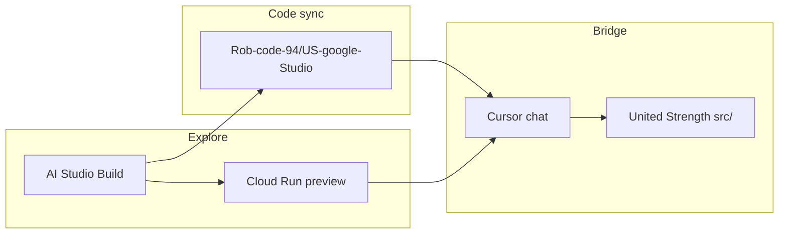

# AI Studio ↔ Cursor bridge

United Strength beta UX/UI runs in Google AI Studio; Cursor ports approved patterns into the production Next.js repo.

## Canonical surfaces

| Surface | URL | Role |
|---------|-----|------|
| **AI Studio app** | https://aistudio.google.com/apps/f0b0ce5b-993b-4c03-9e60-d6063c477bd2 | Edit prompts, iterate UI in Build |
| **Live preview** | https://ais-pre-fewk45ctma7odjkgzbjqcl-20545025737.us-east1.run.app | Mobile preview / stakeholder share (375px) |
| **Studio code (GitHub)** | https://github.com/Rob-code-94/US-google-Studio | **Google AI Studio edits only** — not the production app |
| **Production repo** | This workspace (`United Strength`) | Next.js — port approved patterns into `src/` |
| **Production dev** | http://localhost:3000 | Local validation after porting |

**Repo scope:** `Rob-code-94/US-google-Studio` holds Studio-exported source only. Never deploy from that repo. The main `United Strength` repo is the production target.

## Workflow

1. **Explore** — iterate in AI Studio; review at Cloud Run preview (375px)
2. **Decide** — lock nav, hero, overlay, motion in Cursor chat against Todd rules + brand kit
3. **Sync code** — push/pull [Rob-code-94/US-google-Studio](https://github.com/Rob-code-94/US-google-Studio)
4. **Port** — reimplement in `src/` with project tokens and components
5. **Validate** — compare Cloud Run preview vs `localhost:3000` at 375px

## Import steps (Cursor)

1. Clone or pull `https://github.com/Rob-code-94/US-google-Studio`
2. Diff layout, nav, hero, and overlay against `src/components/layout/` in this repo
3. Reimplement patterns using [brand-tokens.mdc](../../.cursor/rules/brand-tokens.mdc) and [united-strength-brand/SKILL.md](../../.cursor/skills/united-strength-brand/SKILL.md)
4. Never copy-paste raw AI Studio HTML into production components

## Ownership split

| AI Studio owns | Cursor / main repo owns |
|----------------|-------------------------|
| Layout experiments | Next.js components (`src/components/`) |
| Nav overlay feel | `SiteHeader`, `MobileNav`, `TopBar` |
| Hero composition | `BrandIntroBlock`, media components |
| Scroll behavior (crest transition) | `useScrollDirection`, tokenized CSS |
| Visual direction drafts | Sitemap routes, embed pages, production media |

## Alignment checklist

Before marking nav/hero/overlay work done:

- [ ] Hamburger on **left**
- [ ] Crest transition: scroll up = **UNITED STRENGTH CLUB** wordmark; scroll down = monogram
- [ ] Top bar when scrolled: `Columbus, OH | {weekday}, {date}`
- [ ] Full-viewport **dark overlay** (not right-slide drawer)
- [ ] Stealth monogram watermark ~5–8% opacity
- [ ] No Buy, Reserve, or Member in public nav or overlay
- [ ] Culture Club tokens (`#FFFFFF`, `#181818`, `#0A3C2E` membership CTA only)
- [ ] Homepage: 3 blocks max (hero, apply band, footer)
- [ ] Mobile-first — validate at 375px

Guardrails: [todd-nav-preferences.mdc](../../.cursor/rules/todd-nav-preferences.mdc) · [mobile-first.mdc](../../.cursor/rules/mobile-first.mdc)

## Anti-patterns

- Shipping AI Studio HTML directly into `src/`
- Treating `US-google-Studio` as the deploy target
- Implementing nav/hero changes without checking the live preview
- Diverging preview from repo without updating docs

## Related docs

| Doc | Purpose |
|-----|---------|
| [ai-studio-brief.md](../client/ai-studio-brief.md) | Prompts, uploads, follow-ups |
| [united-strength-aesthetic.md](../brand/united-strength-aesthetic.md) | Brand kit + prototype surfaces |
| [united-strength-brand/SKILL.md](../../.cursor/skills/united-strength-brand/SKILL.md) | Beta implementation backlog |
